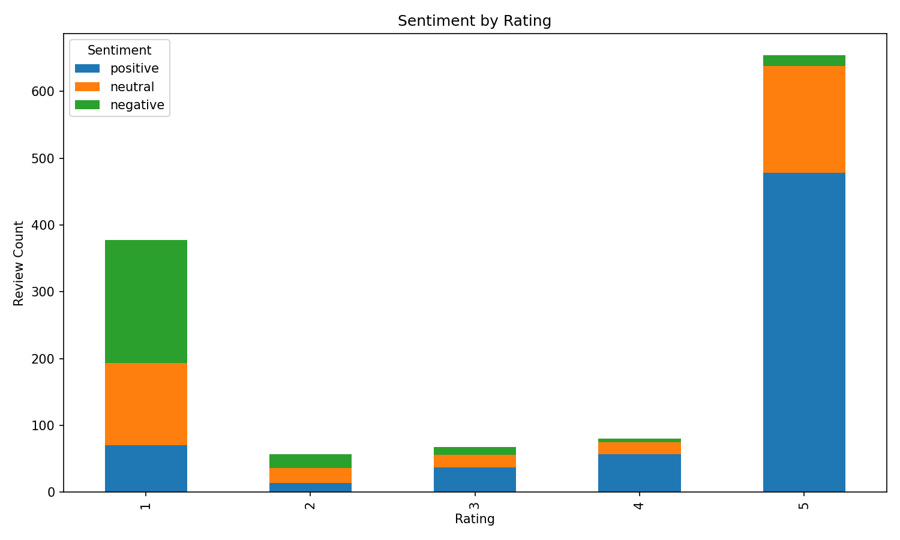
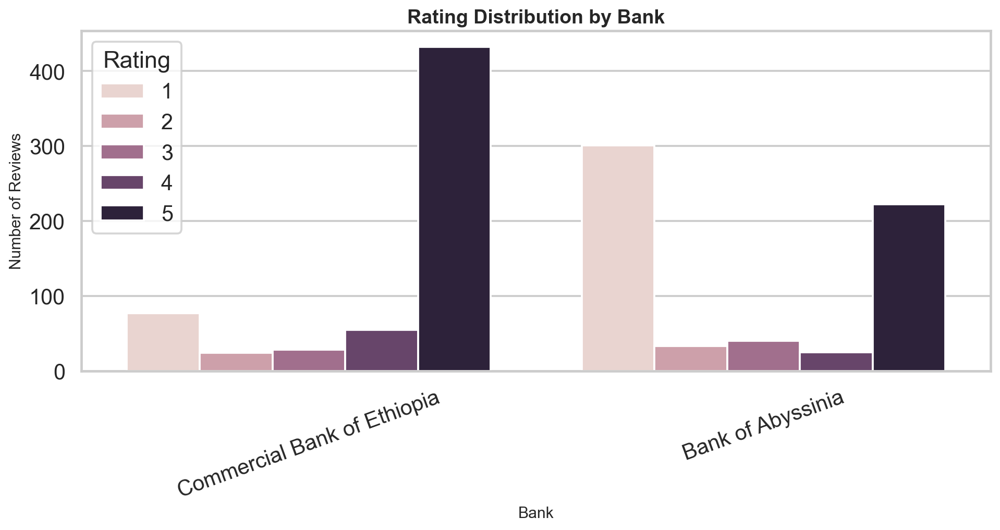

# Customer Experience Analytics for Fintech Apps

**Week 2 Challenge Final Report**  
**10 Academy**  
**Project:** Fintech Review Analytics  
**Data Source:** Google Play Reviews  
**Prepared by:** Project Team  

---

## 1. Title Page

This report presents the final analysis for the Week 2 “Customer Experience Analytics for Fintech Apps” challenge. The project uses Google Play review data to evaluate customer satisfaction, extract recurring product themes, compare bank app performance, and recommend practical product improvements for Ethiopian mobile banking applications.

The analysis pipeline covers data collection, preprocessing, sentiment scoring, theme extraction, PostgreSQL schema design, visualization, and business recommendations.

## 2. Executive Summary

The project analyzed customer reviews for mobile banking applications from Commercial Bank of Ethiopia, Bank of Abyssinia, and Dashen Bank. The current completed dataset contains usable analyzed results for **Commercial Bank of Ethiopia** and **Bank of Abyssinia**. Dashen Bank was included in the scraping configuration, but the current collection returned **0 usable Dashen reviews**, so no Dashen product performance claims are made in this report.

The final analyzed dataset contains **1,237 cleaned and sentiment-scored reviews**. Commercial Bank of Ethiopia performs better overall, with **616 analyzed reviews**, an **average rating of 4.20**, and **401 positive reviews**. Bank of Abyssinia shows higher customer experience risk, with **621 analyzed reviews**, an **average rating of 2.73**, and **184 negative reviews**.

The main business conclusion is that **Commercial Bank of Ethiopia should protect and refine its usability and transaction experience**, while **Bank of Abyssinia should prioritize app stability, performance, and core workflow reliability**.

## 3. Project Overview and Objectives

The business objective is to convert unstructured app-store reviews into decision-ready product insights. Mobile banking reviews contain direct customer feedback about reliability, ease of use, transaction success, account access, support quality, and feature expectations.

The project objectives were to:

- collect Google Play reviews for selected Ethiopian banking apps;
- clean and standardize review data;
- classify sentiment and extract recurring themes;
- store structured review data in PostgreSQL;
- generate figures and summaries for business reporting;
- translate findings into bank-specific product recommendations.

## 4. Data Collection Methodology

Reviews were collected using the `google-play-scraper` package. The scraper targeted the following Google Play package IDs:

- Commercial Bank of Ethiopia: `com.combanketh.mobilebanking`
- Bank of Abyssinia: `com.boa.boaMobileBanking`
- Dashen Bank: `com.dashen.dashensuperapp`

The scrape was run for the date window **2024-01-01 to 2024-12-31**. Reviews were requested newest-first and filtered locally by date because the Google Play scraping interface does not provide a server-side date filter.

The current collection produced **1,323 raw reviews**:

- Commercial Bank of Ethiopia: **660 raw reviews**
- Bank of Abyssinia: **663 raw reviews**
- Dashen Bank: **0 raw reviews**

The absence of Dashen reviews is treated as a data coverage limitation rather than a performance result.

## 5. Data Cleaning and Preprocessing

The preprocessing pipeline standardized raw scraper output into the fields `review`, `rating`, `date`, `bank`, and `source`. It removed duplicate review records, dropped rows missing review text or rating, and normalized review dates to `YYYY-MM-DD`.

After preprocessing, the dataset was reduced from **1,323 raw reviews** to **1,237 cleaned reviews**:

- Commercial Bank of Ethiopia: **616 cleaned reviews**
- Bank of Abyssinia: **621 cleaned reviews**

The final sentiment-ready dataset had no missing values in the key analytical fields: bank, rating, sentiment label, sentiment score, and identified theme.

## 6. Sentiment Analysis Methodology

The project supports transformer-based sentiment classification with `distilbert-base-uncased-finetuned-sst-2-english`. For the completed run, the lightweight fallback path was used with VADER sentiment scoring. VADER is suitable for short app-store review text and can produce fast, interpretable positive, neutral, and negative classifications.

The sentiment pipeline generated:

- `sentiment_label`: positive, neutral, or negative;
- `sentiment_score`: sentiment strength or confidence score;
- `identified_theme`: a rule-based theme label used for downstream reporting.

The sentiment results align with review ratings. Five-star reviews are mostly positive, while one-star reviews carry most of the negative sentiment. This supports the directional validity of the sentiment output.

## 7. Theme Extraction Methodology

Theme extraction used keyword matching and TF-IDF/ngram logic to identify recurring business topics. The theme categories included general feedback, transactions, usability, performance, customer support, and account access.

The approach is transparent and easy to explain, which is useful for an interim product analytics project. However, the large number of reviews assigned to `general` shows that future work should improve theme specificity through richer banking dictionaries, manual review, or more advanced topic modeling.

## 8. PostgreSQL Schema and Data Loading

The PostgreSQL schema is saved in `sql/schema.sql`. It uses a normalized structure with two main tables:

- `banks`: stores bank metadata such as `bank_id`, `bank_name`, and `app_name`;
- `reviews`: stores review-level data including review text, rating, review date, sentiment label, sentiment score, identified theme, and source.

The `reviews.bank_id` field references `banks.bank_id`, which avoids repeated bank metadata in review rows. The schema includes primary keys, a foreign key, rating and sentiment checks, indexes, timestamps, and a unique constraint to prevent duplicate review records.

Python scripts are available to initialize the schema, load processed review data, and run database integrity checks.

## 9. Key Findings and Visualizations

Commercial Bank of Ethiopia has the strongest customer experience signal in the current dataset. It has a high average rating of **4.20**, a large positive sentiment count of **401**, and a low negative sentiment count of **55**.

Bank of Abyssinia shows more serious experience issues. It has an average rating of **2.73**, with **255 positive**, **182 neutral**, and **184 negative** reviews. This balance indicates a mixed customer experience with a substantial negative segment.

Rating patterns support the sentiment findings. Five-star reviews are dominated by positive sentiment, while one-star reviews contain most negative feedback.

Theme analysis shows that both banks have many broad general comments, but their specific product signals differ. CBE’s more specific themes include transactions and usability, while BOA’s include performance and transactions.

The rating distribution also shows CBE’s stronger customer satisfaction position relative to BOA.

## 10. Bank-by-Bank Analysis for CBE, BOA, and Dashen

### Commercial Bank of Ethiopia

Commercial Bank of Ethiopia has **616 analyzed reviews**, an **average rating of 4.20**, and a strong positive sentiment profile. It recorded **401 positive**, **160 neutral**, and **55 negative** reviews. Its leading themes include general feedback, transactions, usability, customer support, and account access.

The observed evidence suggests that CBE’s app is broadly well received, especially around usability and core banking functionality. However, complaints still appear around transactions, transfers, updates, and application behavior.

### Bank of Abyssinia

Bank of Abyssinia has **621 analyzed reviews**, an **average rating of 2.73**, and a much larger negative review segment. It recorded **255 positive**, **182 neutral**, and **184 negative** reviews. Its leading themes include general feedback, performance, transactions, customer support, and account access.

The data suggests that BOA customers value the app when core banking functions work, but performance and reliability issues are more visible than for CBE. Complaint keywords include app, worst, banking, bank, and work.

### Dashen Bank

Dashen Bank was included in the scraper configuration, but the current run returned **0 usable reviews**. Therefore, this report does not evaluate Dashen’s sentiment, rating, themes, satisfaction drivers, or pain points. A follow-up scrape is required before Dashen can be compared responsibly.

## 11. Satisfaction Drivers and Pain Points per Bank

For CBE, observed satisfaction drivers are broad positive customer experience and usability. Transactions also appear as a major theme, meaning transaction workflows are important to customer perception. The main pain points are transaction-related complaints and application/update issues.

For BOA, observed satisfaction drivers are broad positive experience and transactions. The main pain points are broad negative experience and performance. The presence of performance as a top theme and complaint keywords such as app, worst, and work suggests that reliability is a central issue.

For Dashen, satisfaction drivers and pain points are not available from the current dataset.

## 12. Concrete Recommendations per Bank

### Commercial Bank of Ethiopia

CBE should protect its usability advantage by keeping high-frequency journeys simple and reliable. Login, balance checks, transfers, and payments should remain low-friction.

CBE should also improve transaction reliability and status transparency. Negative feedback includes transaction, transfer, update, and application keywords, so the product team should prioritize failed transaction handling, clearer confirmations, and release quality around core banking flows.

### Bank of Abyssinia

BOA should prioritize app stability and performance before expanding feature scope. The negative review volume and performance theme indicate that reliability improvements are likely to have the highest customer impact.

BOA should also improve transaction workflows and account access journeys. Transactions are both a satisfaction driver and a recurring theme, while account access appears among the top themes. The product team should review transfer completion, login, OTP, and recovery flows.

### Dashen Bank

Dashen should first be addressed as a data coverage issue. The next product analytics step is to rerun scraping with verified package metadata, country settings, and language settings. Product recommendations should be deferred until review data is available.

## 13. Limitations and Ethical Considerations

The analysis is limited by app-store review bias. Users who leave reviews may represent unusually positive or negative experiences. The dataset also excludes customers who use the apps but never write public reviews.

Dashen Bank is not represented in the current results, so no Dashen product conclusions should be inferred. Theme extraction is also limited by the broad `general` category, which reduces the precision of product-level interpretation.

Ethically, the analysis avoids personal identification and focuses only on public app review content. Raw data and processed CSV files are kept out of GitHub through `.gitignore`.

## 14. Future Improvements

Future work should focus on improving Dashen data coverage, refining theme extraction, and validating findings with manual review samples. The transformer sentiment model should be used when the environment is stable enough to support it, especially for nuanced or mixed-language reviews.

The PostgreSQL database should be used as the main analysis store for repeatable reporting. Additional dashboards can then be built on top of the normalized `banks` and `reviews` tables.

## 15. Conclusion

The project successfully built an end-to-end review analytics pipeline for fintech app customer experience analysis. It collected Google Play reviews, cleaned and standardized the data, scored sentiment, extracted themes, generated visual summaries, designed a normalized PostgreSQL schema, and produced business recommendations.

The current results show that Commercial Bank of Ethiopia has a stronger customer satisfaction profile, while Bank of Abyssinia has more urgent performance and reliability improvement needs. Dashen Bank remains a data collection gap and should be prioritized in the next iteration.
