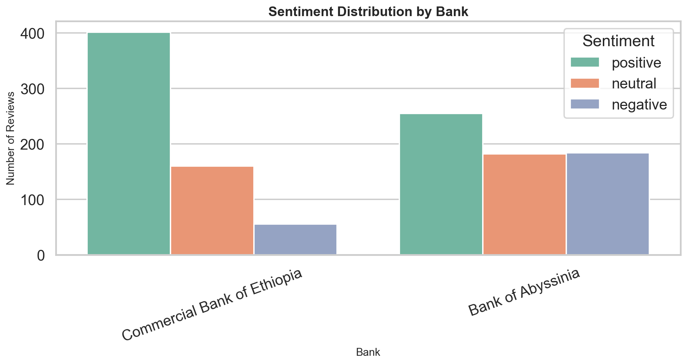
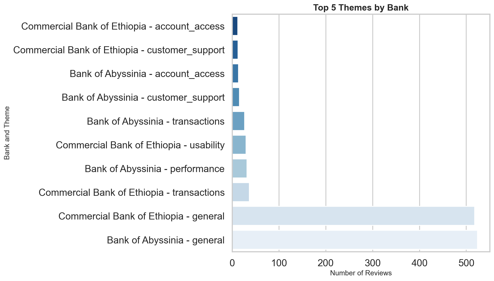

# Interim Report: Customer Experience Analytics for Fintech Apps

**10 Academy Week 2 Challenge**  
**Project:** Fintech Review Analytics  
**Prepared for:** Product and Business Stakeholders  
**Data source:** Google Play reviews  

## 1. Project Overview and Business Objective

This project analyzes customer reviews for Ethiopian fintech and mobile banking apps to identify satisfaction drivers, recurring pain points, and product improvement opportunities. The business goal is to turn unstructured Google Play feedback into practical insights that product managers, engineering teams, and customer experience leaders can use to prioritize improvements.

The current interim analysis focuses on review collection, preprocessing, early sentiment analysis, theme extraction, database readiness, and initial product recommendations. The analysis is based only on data generated by the project pipeline.

## 2. Data Collection Status

Reviews were collected from Google Play using the `google-play-scraper` package. The configured apps were Commercial Bank of Ethiopia, Bank of Abyssinia, and Dashen Bank.

The current scrape used the date window **2024-01-01 to 2024-12-31** and produced **1,323 raw reviews**. Commercial Bank of Ethiopia contributed **660 raw reviews**, while Bank of Abyssinia contributed **663 raw reviews**. Dashen Bank returned **0 reviews** in this run, so Dashen-specific findings are not included in the current analysis.

This is an important interpretation point: Dashen is not rated as good or bad in this interim report. It is simply not represented in the current usable dataset and requires a follow-up scrape with verified package ID, country, and language settings.

## 3. Preprocessing Status and Data Quality Summary

The preprocessing pipeline standardized the review dataset into the core fields `review`, `rating`, `date`, `bank`, and `source`. It removed duplicate reviews, dropped rows missing review text or rating, and normalized review dates to `YYYY-MM-DD`.

After preprocessing, the dataset was reduced from **1,323 raw reviews** to **1,237 cleaned reviews**. The cleaned dataset contains **621 reviews for Bank of Abyssinia** and **616 reviews for Commercial Bank of Ethiopia**. The processed sentiment dataset has no missing values in the key analysis columns: bank, rating, sentiment label, sentiment score, and identified theme.

The main data quality limitation is thematic specificity. Many reviews are currently assigned to a broad `general` theme, which means the initial theme model is useful for directional analysis but should be refined before final production use.

## 4. Early Sentiment Findings

Commercial Bank of Ethiopia currently shows stronger customer satisfaction than Bank of Abyssinia. CBE has **401 positive**, **160 neutral**, and **55 negative** reviews, with an average rating of **4.20**. Bank of Abyssinia has **255 positive**, **182 neutral**, and **184 negative** reviews, with an average rating of **2.73**.

The sentiment distribution aligns with the rating distribution: five-star reviews are mostly positive, while one-star reviews carry most of the negative sentiment. This provides an early validation that the sentiment scoring is directionally consistent with explicit customer ratings.

## 5. Early Theme and Keyword Findings

Theme extraction was performed using keyword logic and TF-IDF/ngram analysis. The most frequent themes across the current dataset are broad general feedback, transactions, usability, performance, customer support, and account access.

For **Commercial Bank of Ethiopia**, the top themes are general feedback, transactions, usability, customer support, and account access. This suggests that CBE’s customer experience discussion is centered on core banking journeys and ease of use. Complaint keywords include app, transaction, update, transfer, and application.

For **Bank of Abyssinia**, the top themes are general feedback, performance, transactions, customer support, and account access. This indicates a stronger reliability and performance concern. Complaint keywords include app, worst, banking, bank, and work, which point to broader dissatisfaction with the app experience.

## 6. Database Progress

The PostgreSQL schema has been designed and saved in `sql/schema.sql`. The schema is normalized into two main tables: `banks` and `reviews`. The `banks` table stores bank metadata, while the `reviews` table stores review text, rating, review date, sentiment label, sentiment score, identified theme, and source.

The schema includes primary keys, a foreign key from `reviews.bank_id` to `banks.bank_id`, rating and sentiment checks, indexes, and a uniqueness constraint to prevent duplicate review records. Python loader and integrity-check scripts are also available to insert processed data and validate counts, ratings, nulls, foreign keys, and duplicate business keys.

## 7. Visual Summary

The project has generated report-ready visual outputs in `reports/figures/`. The most useful interim visuals are the sentiment distribution by bank and the top themes by bank, both embedded above. Additional generated visuals include sentiment by rating, rating distribution by bank, average rating by bank, and sentiment over time.

These visuals are suitable for stakeholder discussion, but they should be interpreted as interim outputs because Dashen Bank is not represented in the current dataset.

## 8. Challenges and Blockers

The biggest blocker is missing Dashen Bank review coverage. The scraper returned no usable Dashen reviews in the current run, so comparisons are limited to Commercial Bank of Ethiopia and Bank of Abyssinia.

A second challenge is that the early theme extraction still produces a large `general` category. This limits the granularity of product recommendations and should be improved with stronger banking-specific keyword dictionaries, manual review of samples, or a more advanced topic modeling approach.

There were also environment setup challenges around PostgreSQL tooling and Python dependencies, but these were resolved sufficiently to continue the pipeline.

## 9. Next Steps and Roadmap

The next priority is to rerun Dashen Bank data collection using verified app metadata and locale settings. Once Dashen reviews are available, the comparison can be expanded across all three banks.

The second priority is to refine theme extraction. The current approach provides useful early signals, but the broad `general` category should be reduced by improving keyword mappings and reviewing a sample of customer comments manually.

The third priority is to load the final processed dataset into PostgreSQL and run the database integrity checks before final submission. After that, the final report can be exported to PDF with the embedded figures and concise bank-specific recommendations.

## 10. Interim Bank-Level Recommendations

Commercial Bank of Ethiopia should protect its current usability advantage and focus on transaction reliability. Its high average rating and strong positive sentiment indicate a relatively healthy app experience, but complaints around transactions, transfers, updates, and application behavior should be addressed before they become larger trust issues.

Bank of Abyssinia should prioritize stability, performance, and core workflow reliability. Its lower average rating and higher negative sentiment suggest more urgent product risk. The strongest improvement opportunities are app performance, transaction completion, account access, and support-related user journeys.

Dashen Bank requires additional data collection before product recommendations can be made responsibly.

## 11. Conclusion

The interim analysis shows that customer review analytics can provide actionable product signals for fintech apps. Commercial Bank of Ethiopia currently leads on satisfaction and rating performance, while Bank of Abyssinia shows stronger signs of customer friction, especially around app reliability and performance.

The project has completed the main pipeline foundations: scraping, preprocessing, sentiment scoring, theme extraction, PostgreSQL schema design, visual reporting, and draft recommendations. The remaining work is to improve data coverage for Dashen, refine theme specificity, validate the database load, and prepare the final PDF report.
